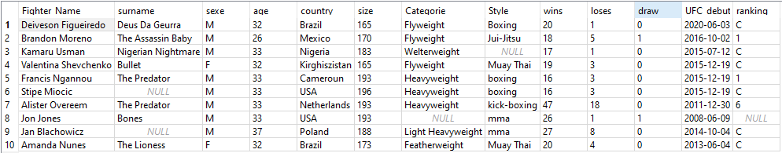
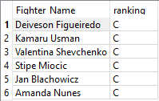

I practiced few years mixed martial arts and I still like watching some UFC or other organizations events
I picked this subject to train on SQL language :

```sql
CREATE TABLE UFC (
    Figther_Name TEXT         NOT NULL,
    surname     TEXT,
    sexe        TEXT,
    age         SMALLINT,
    country     TEXT,
    size [(cm)] NUMERIC,
    Categorie   TEXT,
    Style       TEXT,
    wins        SMALLINT,
    loses       SMALLINT,
    draw        SMALLINT,
    UFC_debut   DATE,
    ranking     VARCHAR,
    PRIMARY KEY (
        Fighter_Name
    )
);

INSERT INTO UFC (Figther_Name, surname, sexe, age, country, size, Categorie, Style, wins, loses, draw, UFC_debut, ranking) 
VALUES ('Deiveson Figueiredo', 'Deus Da Geurra', 'M', 32, 'Brazil', 165, 'Flyweight', 'Boxing', 20, 1, 0, '2020-06-03', 'C');

INSERT INTO UFC (Figther_Name, surname, sexe, age, country, size, Categorie, Style, wins, loses, draw, UFC_debut, ranking) 
VALUES ('Brandon Moreno', 'The Assassin Baby', 'M', 26, 'Mexico', 170, 'Flyweight', 'Jui-Jitsu', 18, 5, 1, '2016-10-02', 1);
```
etc

```sql
select * from UFC
```





```sql
select Fighter_Name, ranking from UFC where ranking = 'C';
```



For more, check the other files...
